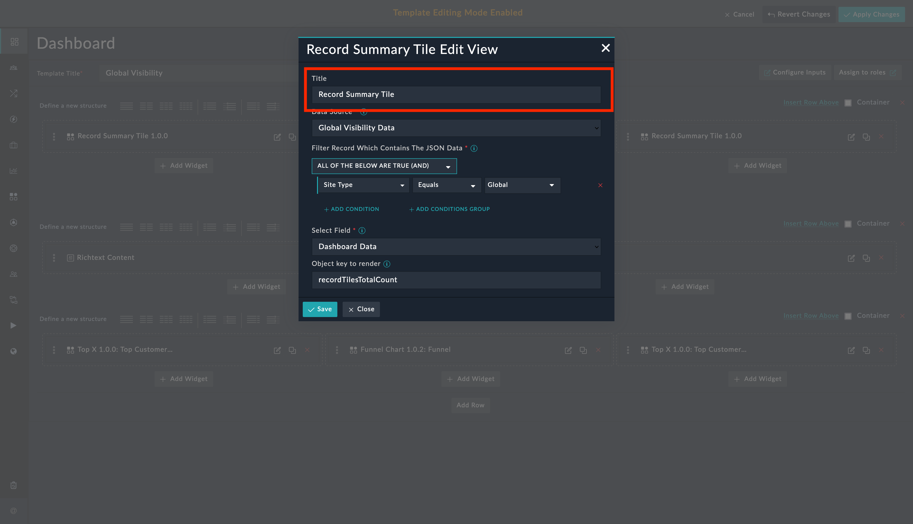
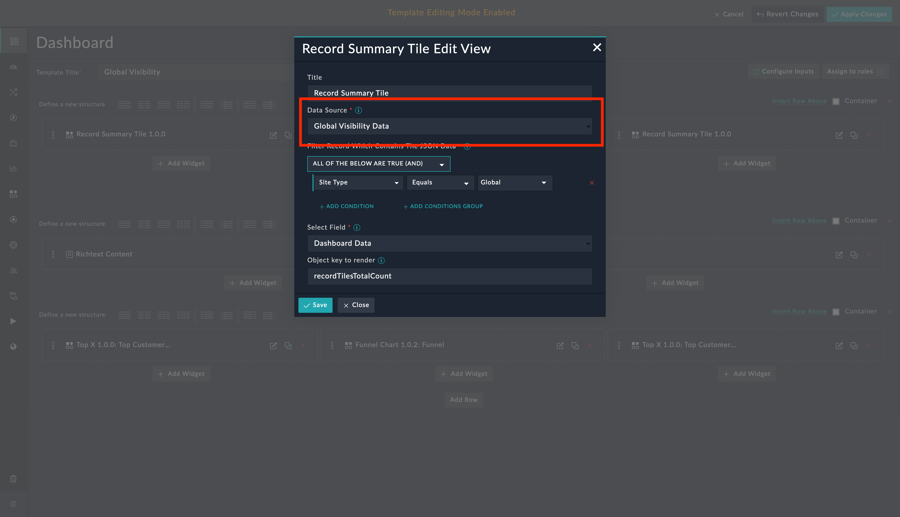
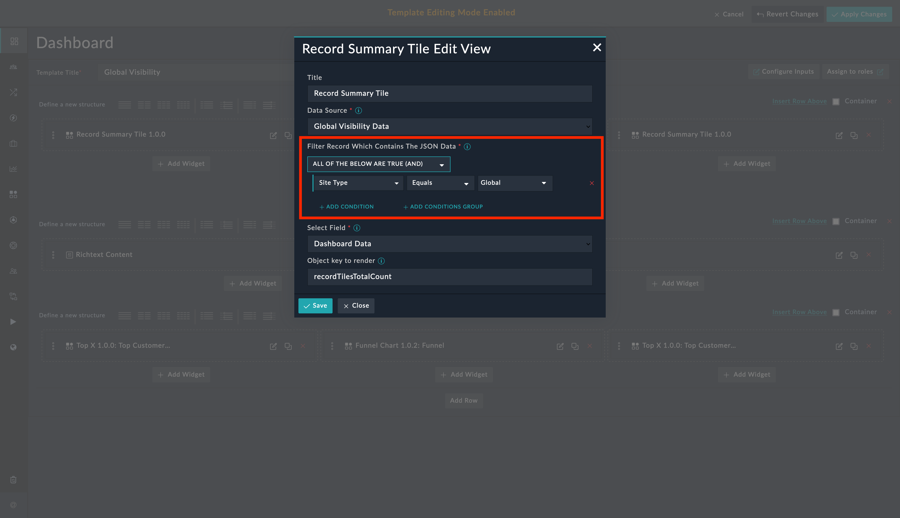
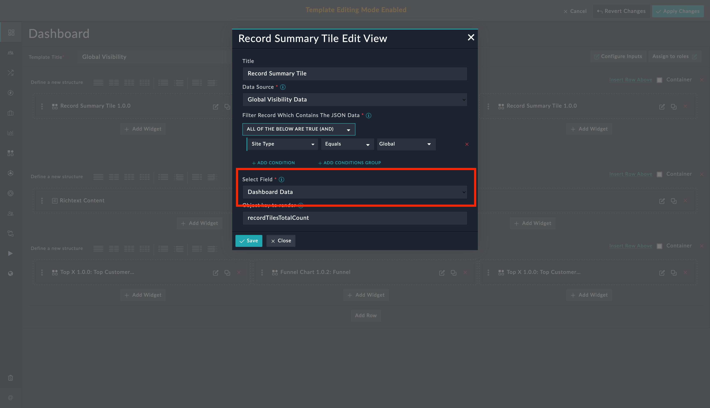
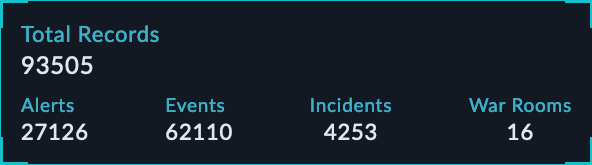
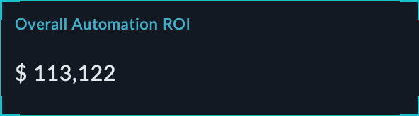

| [Home](../README.md) |
|----------------------|

# Usage
To use this widget users need to provide a JSON in a certain format for the widget to render data.

This JSON data must be in a module's record that has a field of type JSON.

<table>
    <td><strong>IMPORTANT</strong></td>
    <td>The <code>JSON</code> data to be rendered must have <strong><em>at least one</em></strong> of the following:
        <ul>
            <li><code>data</code> key</li>
            <li><code>title</code> and <code>value</code> keys</li>
        </ul>
    </td>
</table>

Following are two acceptable JSON formats:

<table>
    <thead>
        <th>With <code>data</code> Key</th>
        <th>Without <code>data</code> Key</th>
    </thead>
    <tr>
        <td>
            <pre>
{
"recordTilesTotalCount": {
    "data": {
        "Alerts": 27126,
        "Events": 62110,
        "Incidents": 4253,
        "War Rooms": 16
            },
    "title": "Total Records",
    "value": 93505
    }
}
            </pre>
        </td>
        <td>
            <pre>
{
"recordTilesCustomerData": {
    "title": "Total Records",
    "value": "93,505"
    }
}
</pre>
        </td>
    </tr>
</table>

## Record Summary Tile

1. Edit a *Dashboard*'s view template and select **Add Widget** button.

2. Select **Record Summary Tile** from the list to bring up the **Record Summary Tile** widget's edit view.

3. Specify the title of the visual depiction of each record node in the group in the **Title** field.

    

4. Select the module, whose records are to be displayed, in the **Select Data Source** field. The drop-down lists only those modules that support JSON data fields. For details on editing and creating modules, refer to the *Module Editor* section of the FortiSOAR *Administration Guide*, [here](https://docs.fortinet.com/document/fortisoar/7.4.1/administration-guide/97786/application-editor#Module_Editor).

    

5. Define the filter criteria using which to filter the data to be rendered by this widget.

    <table>
        <thead>
            <th>Example</th>
        </thead>
        <tbody>
            <td>Filters can be applied for tasks like displaying the widget with only those asset records that meet the following criteria:
                <ul>
                    <li>Site Type is <em>Global</em></li>
                </ul>
            </td>
        </tbody>
    </table>

    

6. Select the field, whose data is to be displayed, in the **Select Field** field. The drop-down lists fields of type `JSON`. For details on editing and creating fields, refer to the *Module Editor* section of the FortiSOAR *Administration Guide*, [here](https://docs.fortinet.com/document/fortisoar/7.4.1/administration-guide/97786/application-editor#Module_Editor).

    

7. Specify the JSON `key` whose `value` is to be rendered in the **Object key to render** field.

    - You can leave this field blank if the field you selected in the previous step has **_un-nested_** `title` and `value` keys. For example:

        ```JSON
        "title":"",
        "value":""
        ```

    - If the field you selected in the previous step contains nested `title`, `value`, and an additional `data` key, then specify the JSON object containing these keys in the **Object key to render** field. For example:

        ```JSON
        "data":{
            "key1":"",
            "key2":"",
            "key3":"",
        }
        "title":"",
        "value":""
        ```

<table>
    <thead>
        <th>Example</th>
    </thead>
    <tbody>
        <td>Consider the following JSON data in one of the record's JSON field:
            <pre>
{
"recordTilesTotalCount": {
    "data": {
        "Alerts": 27126,
        "Events": 62110,
        "Incidents": 4253,
        "War Rooms": 16
            },
    "title": "Total Records",
    "value": 93505
    }
}
    </pre>
            <p>The following screenshot shows the Record Summary Tile in action with this JSON data, when you enter <code>recordTilesTotalCount</code> in the <strong>Object Key to Render</strong> field.</p>
            <p></p>
            <p>Consider the following JSON data in one of the record's JSON field:</p>
            <pre>"recordTilesCustomerData": {
                "title": "Overall Automation ROI",
                "value": "$ 113,122"
            }</pre>
            <p>The following screenshot shows the Record Summary Tile in action with this JSON data, when you enter <code>recordTilesTotalCount</code> in the <strong>Object Key to Render</strong> field.</p>
            <p></p>
        </td>
    </tbody>
</table>

| [Installation](./setup.md#installation) | [Configuration](./setup.md#configuration) |
|-----------------------------------------|-------------------------------------------|