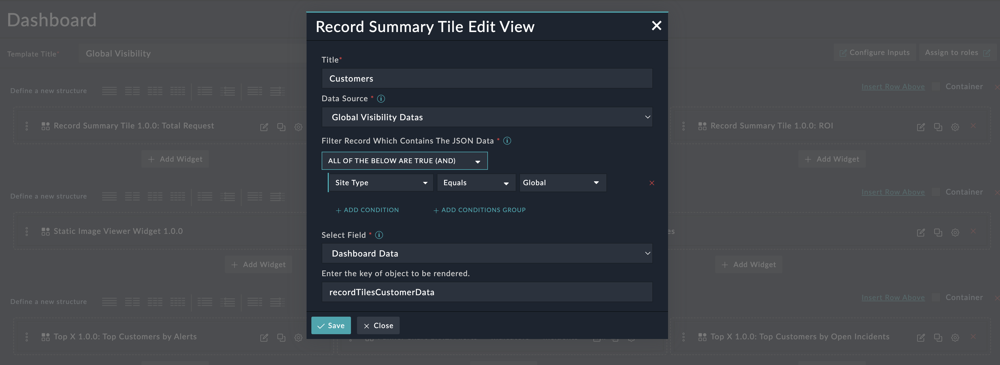
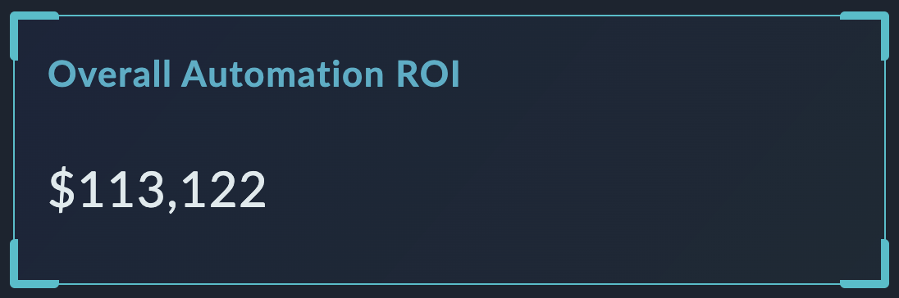

| [Home](../README.md) |
|----------------------|

# Usage
To use this widget users needs to provide a JSON in a certain format for the widget to render data.
This JSON data must be in a field of a record in a module.


## Widget Preview and How to Use
This can display data in 2 forms based on JSON provided:

1. Where 'data' key is present inside the JSON provided

    Edit View 

    In the field, "Enter the key of object to be rendered" contains the main key of the object "recordTilesCustomerData", if there is no key for the object leave the field blank.
      In this example the JSON has a key "data", "title" and value.
  
      "data" -  All the key, value pairs present in it would be rendered in the bottom section of the widget, 
      
      "title" - Value in this key would be the title for the Tile
      
      "value" - value present in this key would display the number/text present in the key below the Title

      Record Summary Tile
      

    JSON, edit view and widget tile, when looked at simultaniously gives a clearer picture

    JSON Object which contains the data to be rendered:
    ```JSON
        "recordTilesCustomerData": {
          "data": {
            "Gold": 4000,
            "Diamond": 5000,
            "Platinum": 3000
          },
          "title": "Total Customers",
          "value": "12,000"
        }
    ```


2. Where 'data' key is not present inside the JSON provided
    
    Edit View 
    
    In the field, "Enter the key of object to be rendered" contains the main key of the object "recordTilesROI", if there is no key for the object leave the field blank.
    JSON Object which contains the data to be rendered:
    ```JSON
        "recordTilesROI": {
          "title": "Overall Automation ROI",
          "value": "$113,122"
        }
    ```
    In this example the JSON has a key "title" and value, but no "data" key.
    So the tile will be displayed:
    
    Record Tile 


| [Installation](./setup.md#installation) | [Configuration](./setup.md#configuration) |
|-----------------------------------------|-------------------------------------------|